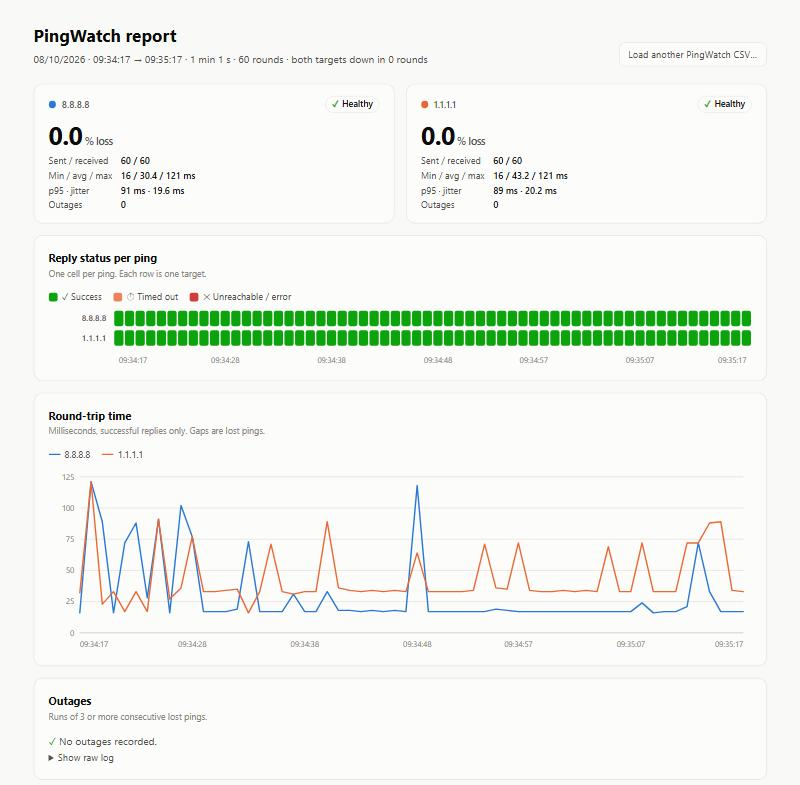
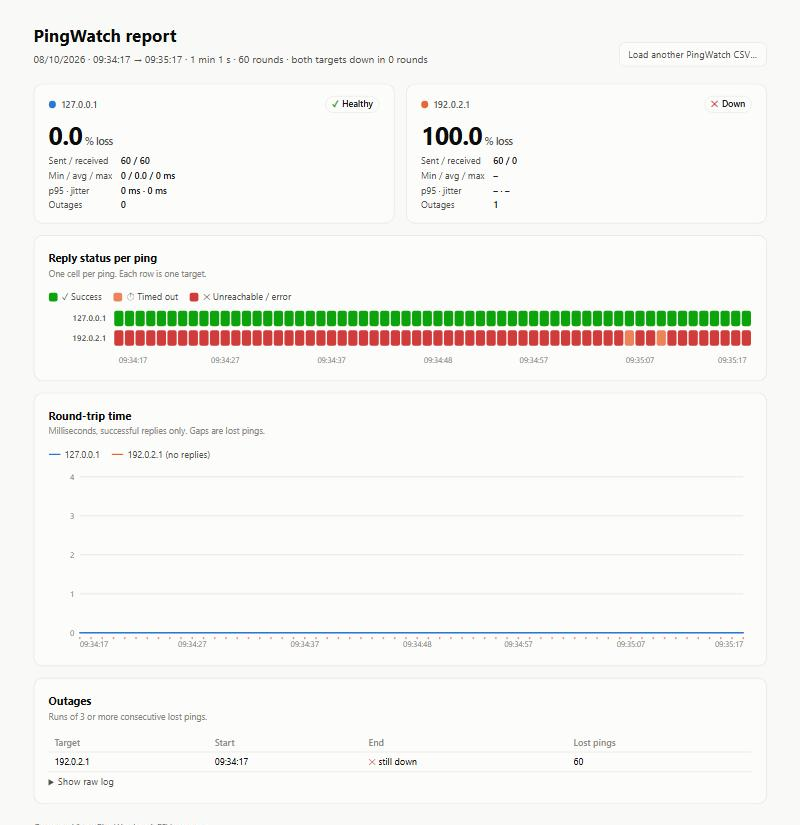

# PingWatch

The goal of this project is to provide a portable <code>PowerShell</code> script to monitor two IPs at the same time and get real statistics at the end, with support for:

* NEW : HTML report with graphs (status per ping, round-trip time, outages) generated automatically at the end of each run, works offline
* Two targets pinged simultaneously (default: every 1 s for 1 h 15 min)
* Live colored output in the console + loss % and time left in the window title
* Every reply logged in a <code>CSV</code> file
* Summary with loss %, min / avg / max / p95 latency, jitter, longest loss streak and outage list
* Detection of rounds where **both** targets failed (local / network-side problem)
* <code>Ctrl+C</code> at any time, the summary is still produced
* Works on Windows PowerShell 5.1 and PowerShell 7+
* No admin rights needed, no module to install
* And much more ...

Results :

* <code>PingWatch_yyyyMMdd_HHmmss.csv</code> with every ping
* <code>PingWatch_yyyyMMdd_HHmmss_summary.txt</code> with the statistics
* <code>PingWatch_yyyyMMdd_HHmmss_report.html</code> with the graphs

Files are written next to the script by default, or in the folder given with <code>-OutputDir</code>.


--------

## Usage

Edit the two IPs in <code>PingWatch.bat</code> and double-click on it.

Or launch it with your own arguments:

```bat
REM Default: 75 minutes, 1 ping per second
PingWatch.bat -Target1 192.168.1.1 -Target2 1.1.1.1

REM 10 minutes, 2 pings per second, files saved in C:\Temp
PingWatch.bat -Target1 192.168.1.1 -Target2 1.1.1.1 -DurationMinutes 10 -IntervalMs 500 -OutputDir C:\Temp
```

Or directly from PowerShell:

```powershell
.\PingWatch.ps1 -Target1 192.168.1.1 -Target2 1.1.1.1 -DurationMinutes 75
```

Parameters :

* <code>-Target1</code> / <code>-Target2</code> : IPs or hostnames to monitor (default **192.168.1.1** and **1.1.1.1**)
* <code>-DurationMinutes</code> : duration of the test (default **75**)
* <code>-IntervalMs</code> : time between ping rounds (default **1000**)
* <code>-TimeoutMs</code> : reply timeout per ping (default **1000**)
* <code>-OutageThreshold</code> : consecutive losses counted as an outage (default **3**)
* <code>-OutputDir</code> : where to save the files (default: script folder)

Tip : use your gateway as <code>Target1</code> and a public IP as <code>Target2</code>. If both fail at the same time, the problem is on the local side. If only the public IP fails, the problem is after your gateway.


--------

## Example

Example files are in the <code>ex/</code> folder, generated by the script itself:

* <code>ex/internet/</code> : 1 minute between <code>8.8.8.8</code> and <code>1.1.1.1</code>, normal Internet connection
* <code>ex/outage/</code> : 1 minute between <code>127.0.0.1</code> (always up) and <code>192.0.2.1</code> (unreachable on purpose)

Each folder contains the 3 files of a run:

* [PingWatch_20261008_093417.csv](ex/internet/PingWatch_20261008_093417.csv)
* [PingWatch_20261008_093417_summary.txt](ex/internet/PingWatch_20261008_093417_summary.txt)
* [PingWatch_20261008_093417_report.html](ex/internet/PingWatch_20261008_093417_report.html)


### HTML report

Internet :



Outage :



Download <code>PingWatch_*_report.html</code> and open it in a browser, works offline. The graphs are drawn with JavaScript, so they stay empty in GitHub, the Windows Explorer preview pane or any viewer that blocks scripts. Use the button **Load another PingWatch CSV...** to display any other run, even one made with an older version of the script.

--------

> :warning: **If you get an error at the end of the run with Windows PowerShell 5.1**: <code>Argument types do not match</code> on <code>$outs = @($s.Outages)</code>. The files are still generated but the outage count is empty. Grab the latest version of the script:
```powershell
#In Get-Summary, replace $outs = @($s.Outages) by:
$outs = $s.Outages.ToArray()
```

> :warning: **If the script is blocked by the execution policy**: Use <code>PingWatch.bat</code>, it launches PowerShell with <code>-ExecutionPolicy Bypass</code> for this script only.

--------
